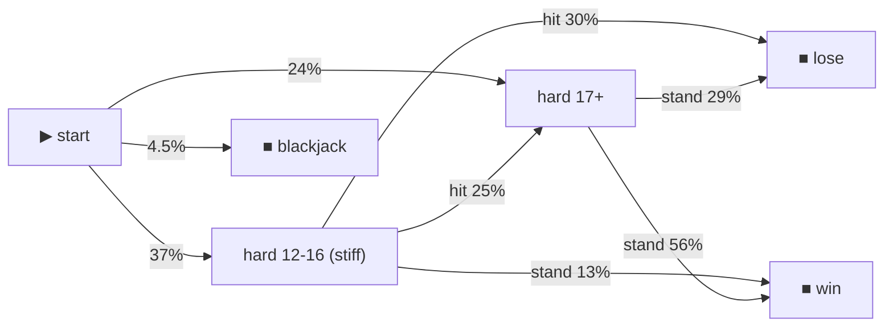

# Example: blackjack — simulating a game with options

Blackjack is the canonical "many options" game, and it makes one point
unavoidable: **a game with choices has no single RTP — only an RTP per policy.**
This example is a *simulation study*: the same game played under five different
player policies, measured with the simulator's pluggable strategy.

```
blackjack RTP by player policy  (1,000,000 hands each)

  policy                          RTP       hands/s
  basic strategy (optimal-ish)    97.69%     ~660,000
  mimic dealer (hit < 17)         94.36%     ~620,000
  random                          65.77%     ~680,000
  always stand                    84.08%     ~820,000
  always hit                      11.49%     ~580,000
```

"What's the RTP of blackjack?" is only answerable as **"under which strategy?"**
Optimal play (basic strategy) is the ceiling; everything else bleeds. That's the
number a regulator cares about for a skill game — the most a player can extract.

## How it works

`src/blackjack.ts` is an open-rgs **complex math** (`open → step* → close`),
currency-blind and RNG-injected like any other. Each decision emits the **public
context** in `ops` (`{ total, soft, dealerUp }`) — exactly what a real player
sees. The policy is a simulator `StrategyFn` that reads that context:

```ts
import { simulate } from "@open-rgs/simulator";
import { basicStrategy } from "./strategy.js";

const [report] = await simulate(manifest, { complexStrategy: basicStrategy });
```

`basicStrategy` reads the public `ops` and returns hit/stand — it never sees the
opaque `state`, so the simulated policy can't cheat on hidden cards. Swap in
`mimicDealer`, `alwaysStand`, `randomPlay`, or your own optimal solver.

## Rules (fixed)

Infinite deck (cards i.i.d.), dealer **stands on all 17 (S17)**, blackjack pays
**3:2**, **hit/stand only**.

## Why hit/stand only (the honest part)

Double and split **change the wager mid-round**. open-rgs deliberately fixes the
bet at round open and moves money **at most twice** (open debit, close credit) —
there is no mid-round debit. So double/split don't fit a *faithful served game*
without modeling the bet as the pre-committed maximum (reserve 2× at open). They
also break naive RTP measurement: a doubled win pays on 2× stake while the
denominator still counts 1× (an early version of this example measured a bogus
108% RTP for exactly that reason). Hit/stand keeps every round at one unit, so
the measured RTP is honest. Split / double / surrender are a natural extension
for the [examples gallery](https://github.com/open-rgs/open-rgs-examples).

## Run

```bash
bun examples/blackjack/src/study.ts   # the policy comparison above
bun examples/blackjack/src/flow.ts    # the play-flow Markov chain (below)
```

## See how it was played (play-flow)

A single RTP number tells you *how much*, not *how*. Pass `flow` to `simulate()`
and the report gains a **Markov chain** of how rounds were actually played —
decision buckets, the action taken, and the transition probability:

```ts
const [r] = await simulate(manifest, { complexStrategy: basicStrategy, flow: { label: bucketLabel } });
// r.flow -> rendered by mdReport as a Mermaid chart + a transition table
```



You can *see* the strategy: stand on 17+, hit the stiff hands and either improve
or bust. That's what makes interactive math easy to eyeball and test — run it,
look at the chart, check the transitions match intent. The node labels come from
the **public** context (`ops`), so the view never depends on hidden state.

## Two tiers (recap)

This example uses the **host-driven** strategy tier — flexible, runs any policy
(even an optimal solver) at ~100k–1M rounds/s. For a *fixed* policy at native
speed, bake it into the kernel and self-play in WASM — see
[`examples/cash-ladder`](../cash-ladder) (`sim_ladder`).
