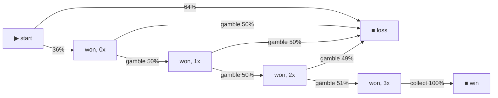

# Example: gamble-slot — the simplest complex round that fits the model

A slot with a **gamble feature**: spin, then double-or-nothing your win on a fair
coin up to 8 times (max **256×** the win), or collect. It's the easiest way to
start writing and **testing interactive (multi-decision) math** on open-rgs.

## Why a gamble fits where blackjack doesn't

open-rgs takes **one bet at open** (price × stake × betIndex) and moves money at
most twice (open debit, close credit). A gamble feature respects that: you only
ever risk the **won amount** (the multiplier), never a second bet. So the payout
stays `multiplier × bet` with `multiplier ≥ 0` — you can lose the win (down to 0)
but never more than your bet. No mid-round debit.

Blackjack's double/split *add a wager mid-round* (you can lose more than the
initial bet), which this model deliberately doesn't allow — so they can't be a
faithful served game here. A gamble can. That's the whole reason this example
exists instead of blackjack.

## The testable invariant: a fair gamble is pure variance

The gamble is **fair** (×2 at p=0.5), so it's EV-neutral. The game's RTP equals
the base slot's (~96%) **under any gamble policy** — gambling only moves
variance, never the edge:

```
gamble-slot: same game, different gamble policy  (1,000,000 rounds each)

  policy                          RTP       hit-rate   mult stddev   max mult
  never gamble (base slot)        96.10%      36.2%         1.81       25x
  gamble once                     96.01%      18.1%         2.73       50x
  gamble to 3x doubles            95.88%       4.5%         5.72      200x
  always gamble (to bust/cap)     96.87%       0.1%        33.57     6400x
```

RTP barely budges; stddev explodes (1.81 → 33.57) and the top win grows 25× →
6400×. That's a sharp, checkable property — and a nice contrast with
[`cash-ladder`](../cash-ladder), whose **unfair** gamble bleeds RTP per rung.

## See how it was played

`bun examples/gamble-slot/src/flow.ts` renders the gamble ladder as a Markov
chain (the 50/50 splits make the *fairness* obvious at a glance):



## How it works

`src/gamble-slot.ts` is an open-rgs **complex math** (`open → step* → close`),
currency-blind + RNG-injected. `open` spins; each `step` is the player's choice
(`gamble` or `collect`) read from `action.value`; the public context (`win`,
`gambles`) goes out in `ops` so strategies and the flow chart can read it without
touching the opaque state.

Policies live in `src/strategy.ts` as simulator `StrategyFn`s
(`neverGamble`, `gambleOnce`, `gambleToTarget(n)`, `alwaysGamble`).

## Run

```bash
bun examples/gamble-slot/src/study.ts   # RTP by policy (the table above)
bun examples/gamble-slot/src/flow.ts    # the gamble-ladder Markov chain
```
